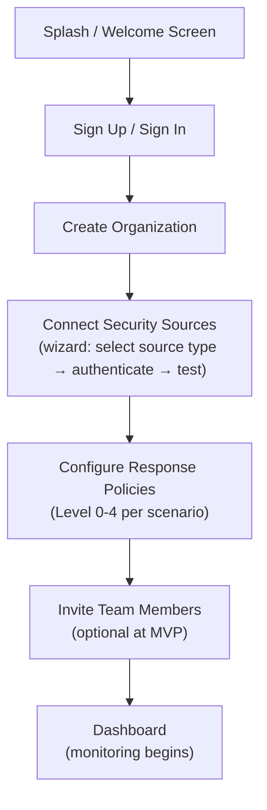
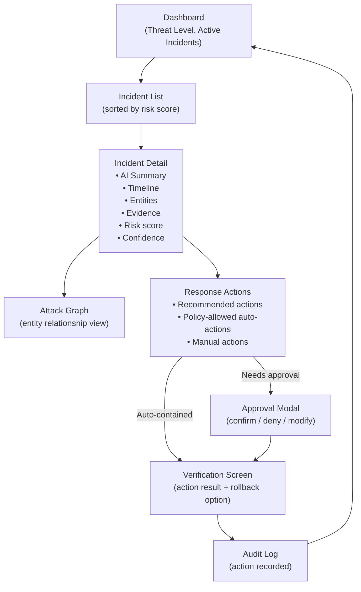
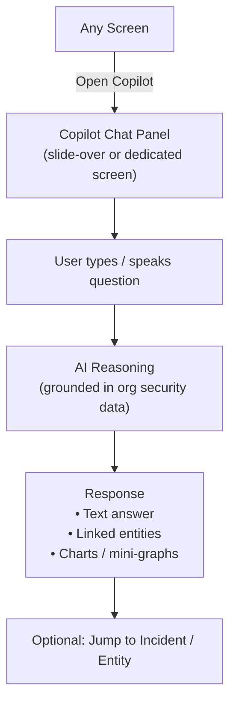
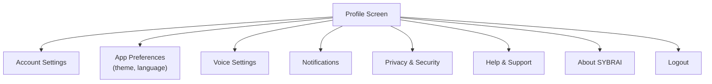

# SYBRAI — Design Brief

> Derived from: [SYBRAI — Product Requirements Document](file:///c:/Users/abbus/Desktop/sybrai/SYBRAI%20%E2%80%94%20Product%20Requirements%20Document.md)

---

## 0. Design Principles

| Principle | Meaning |
|---|---|
| **Security-first clarity** | Every data point must be legible at a glance under stress. Analysts work in high-pressure incidents; ambiguity kills response time. |
| **Minimal, purposeful chrome** | Remove every element that does not help the user detect, understand, or act. |
| **Progressive disclosure** | Show headline risk → drill into evidence → expand to full timeline. Never dump the whole graph at once. |
| **Trust through transparency** | Every AI decision links to its evidence. Every autonomous action shows its policy and rollback path. |
| **Dark-first, light-available** | Default to a dark theme (reduces fatigue during 24/7 SOC shifts). Offer a light theme toggle for daytime / SMB users. |

---

## 1. User Flows

### 1.1 Onboarding Flow (Admin / IT Admin)



**Happy path:** ~5 minutes from sign-up to first events appearing on Dashboard.

---

### 1.2 Core Detection → Response Loop (SOC Analyst)



---

### 1.3 Security Copilot Flow



---

### 1.4 Settings / Profile Flow



---

## 2. Screen Inventory

> **Platform:** Mobile-first (iOS/Android), responsive up to tablet.  
> **Navigation:** Bottom tab bar (5 tabs) + contextual headers.

| # | Screen | Route | Tab |
|---|---|---|---|
| S-01 | Splash / Launch | `/` | — |
| S-02 | Sign In / Sign Up | `/auth` | — |
| S-03 | Onboarding Wizard (3–4 steps) | `/onboard/:step` | — |
| S-04 | **Dashboard** (Home) | `/home` | Home |
| S-05 | **Incident List** | `/incidents` | — (drill from Home) |
| S-06 | **Incident Detail** | `/incidents/:id` | — |
| S-07 | **Attack Graph** | `/incidents/:id/graph` | — |
| S-08 | **Analysis Overview** | `/analysis` | Analysis |
| S-09 | Analysis → Console | `/analysis/console` | Analysis |
| S-10 | Analysis → Debugging | `/analysis/debugging` | Analysis |
| S-11 | Analysis → Learning | `/analysis/learning` | Analysis |
| S-12 | **Records** | `/records` | Records |
| S-13 | Record Detail | `/records/:id` | Records |
| S-14 | **Security Copilot (Chat)** | `/copilot` | Learning |
| S-15 | **Profile & Settings** | `/profile` | Profile |
| S-16 | Entity Detail (User / Device / IP) | `/entities/:type/:id` | — |
| S-17 | Policy Configuration | `/settings/policies` | — |
| S-18 | Notification Center | `/notifications` | — |
| S-19 | Audit Log | `/audit` | — |

---

## 3. Screen Layouts

### S-01 — Splash / Launch

```
┌─────────────────────────┐
│        status bar        │
│                          │
│                          │
│    ╔═══════════════╗     │
│    ║               ║     │
│    ║  SYBRAI LOGO  ║     │
│    ║               ║     │
│    ╚═══════════════╝     │
│                          │
│   "AI Bug Fixer &        │
│    Analyzer"             │
│                          │
│   Describe. Analyze.     │
│   Fix. Learn. Improve.   │
│                          │
│   ┌─────────────────┐   │
│   │  Initializing…  │   │
│   └─────────────────┘   │
│                          │
└─────────────────────────┘
```

- Full-bleed brand gradient background
- Logo: centered, animated entrance (scale + fade)
- Tagline: appears after 0.4 s delay
- Progress indicator: subtle pulsing line

---

### S-04 — Dashboard (Home)

```
┌─────────────────────────┐
│  ≡  Bug Fixer       🔔  │  ← Header: hamburger / title / notif
├─────────────────────────┤
│ ● AI is listening…      │  ← Voice indicator (pulsing)
│ ╭───────────────────╮   │
│ │ 🗨 "My app crashes │   │  ← User message bubble
│ │ when I click the   │   │
│ │ login button."     │   │
│ ╰───────────────────╯   │
│                          │
│ I found 3 possible       │  ← AI response
│ issues:                  │
│  1. Null pointer…        │
│  2. API response…        │
│  3. Incorrect data…      │
│                          │
│ Shall I fix them         │
│ automatically?           │
│                          │
│ ┌──────────┐ ╔══════════╗│
│ │Show Detls│ ║ Auto Fix ║│  ← CTA buttons
│ └──────────┘ ╚══════════╝│
├─────────────────────────┤
│ Type your issue or bug… 🎤⚙│  ← Input bar
├─────────────────────────┤
│ 🏠  📊  📋  📖  👤      │  ← Bottom tab bar
│Home Anlys Rcrds Lrng Prof│
└─────────────────────────┘
```

- **Top bar**: Hamburger menu, screen title, notification bell
- **Chat/Interaction area**: Scrollable, card-based conversation
- **Input bar**: Text field + mic icon + settings gear
- **Bottom tabs**: 5-icon navigation

---

### S-08 — Analysis Overview

```
┌─────────────────────────┐
│  ≡  Analysis          🔽 │  ← Header with filter
├─────────────────────────┤
│ ┌─────┬─────┬─────┬────┐│
│ │Anlys│Cnsle│Debug│Lrng││  ← Horizontal tab strip
│ └─────┴─────┴─────┴────┘│
├─────────────────────────┤
│  Overall Score           │
│  ╔══════════════════╗    │
│  ║   92 / 100       ║    │  ← Circular progress gauge
│  ║   Great! Your    ║    │
│  ║   app is healthy ║    │
│  ╚══════════════════╝    │
│                          │
│  ┌────┐  ┌────┐  ┌────┐ │
│  │ 3  │  │ 2  │  │ 1  │ │  ← Stat cards
│  │Fnd │  │Fxd │  │Warn│ │
│  └────┘  └────┘  └────┘ │
│                          │
│  Recent Sessions         │
│  ┌─────────────────────┐ │
│  │● Login Crash  ✓Fixed│ │  ← Session list items
│  │  Today, 10:30 AM    │ │
│  ├─────────────────────┤ │
│  │● Payment Fail ✓Fixed│ │
│  │  Today, 09:15 AM    │ │
│  ├─────────────────────┤ │
│  │● UI Not Resp ⚠ Warn │ │
│  │  Yesterday, 05:40 PM│ │
│  └─────────────────────┘ │
├─────────────────────────┤
│ 🏠  📊  📋  📖  👤      │
└─────────────────────────┘
```

---

### S-14 — Security Copilot (Chat)

```
┌─────────────────────────┐
│  ←  SYBRAI AI        ••• │  ← Back + overflow menu
├─────────────────────────┤
│ ╭───────────────────╮   │
│ │ 🤖 Hello! I'm     │   │  ← AI greeting bubble
│ │ SYBRAI. How can I │   │
│ │ help you today?   │   │
│ ╰───────────────────╯   │
│                          │
│       ╭───────────────╮ │
│       │ Why is my app │ │  ← User bubble (right-aligned)
│       │ crashing on   │ │
│       │ the splash    │ │
│       │ screen?       │ │
│       ╰───────────────╯ │
│                          │
│ ╭───────────────────╮   │
│ │ 🤖 It looks like a│   │  ← AI response bubble
│ │ null pointer      │   │
│ │ exception in      │   │
│ │ MainActivity.     │   │
│ │ Fix it?           │   │
│ ╰───────────────────╯   │
│                          │
│       ╭───────────────╮ │
│       │ Yes, please   │ │
│       │ fix it.       │ │
│       ╰───────────────╯ │
│                          │
│ ╭───────────────────╮   │
│ │ 🤖 Issue fixed    │   │
│ │ successfully! 🎉  │   │
│ │ Check the result  │   │
│ │ in Analysis.      │   │
│ ╰───────────────────╯   │
├─────────────────────────┤
│ Ask me anything…    🎤 ▶ │  ← Input + mic + send
├─────────────────────────┤
│ 🏠  📊  📋  📖  👤      │
└─────────────────────────┘
```

---

### S-15 — Profile & Settings

```
┌─────────────────────────┐
│  Profile              ⚙  │
├─────────────────────────┤
│   ╭──────╮               │
│   │Avatar│  John Developer│
│   ╰──────╯  john.dev@…   │
│             ┌─────────┐  │
│             │ Pro User │  │  ← Badge
│             └─────────┘  │
├─────────────────────────┤
│  Account Settings     ▸  │
│  App Preferences      ▸  │
│  Voice Settings       ▸  │
│  Notifications        ▸  │
│  Privacy & Security   ▸  │
│  Help & Support       ▸  │
│  About SYBRAI         ▸  │
├─────────────────────────┤
│  ┌─────────────────────┐ │
│  │       Logout        │ │  ← Destructive button
│  └─────────────────────┘ │
├─────────────────────────┤
│ 🏠  📊  📋  📖  👤      │
└─────────────────────────┘
```

---

## 4. Component Library

### 4.1 Navigation

| Component | Description |
|---|---|
| `BottomTabBar` | 5 tabs: Home, Analysis, Records, Learning, Profile. Active tab shows filled icon + accent underline. |
| `TopAppBar` | Title, optional leading icon (hamburger/back), trailing icon(s) (notification, filter, settings). |
| `HorizontalTabStrip` | Scrollable pill-tabs within Analysis screen (Analysis, Console, Debugging, Learning, Records). |
| `SidebarMenu` | Slide-out drawer with section links (Analysis, Console, Debugging, Learning, Records, Profile). |

### 4.2 Input

| Component | Description |
|---|---|
| `ChatInputBar` | Text field + microphone icon + send button. Expands vertically for multi-line. |
| `SearchField` | Leading search icon, placeholder text, trailing clear button. |
| `PolicyToggle` | Labeled switch for enabling/disabling response levels. |
| `DropdownSelector` | Used in onboarding wizard (source type, role assignment). |
| `DateRangePicker` | Selecting time windows for filtering incidents/records. |

### 4.3 Data Display

| Component | Description |
|---|---|
| `RiskGauge` | Circular progress with numeric score centered. Color shifts with severity (green → yellow → orange → red). |
| `StatCard` | Small card showing a metric label + value (e.g., "Issues Found: 3"). Supports color-coded status. |
| `IncidentListItem` | Row: severity icon, title, timestamp, risk badge, status chip. |
| `SessionListItem` | Row: status dot, session name, timestamp, status badge (Fixed / Warning). |
| `EntityBadge` | Pill displaying entity type icon + name + risk score. Tappable to drill into entity detail. |
| `TimelineStep` | Timestamp + event description + entity link. Vertically connected by a line. |
| `AttackGraphNode` | Circle/rounded-rect node representing an entity (User, Device, IP, Process, App, Data). Connected by directional edges. |

### 4.4 Chat

| Component | Description |
|---|---|
| `MessageBubble` | Rounded rectangle. Left-aligned (AI, blue tint) or right-aligned (User, primary blue). Supports markdown rendering. |
| `VoiceIndicator` | Pulsing waveform animation shown when AI is listening or processing voice input. |
| `TypingIndicator` | Three animated dots inside an AI bubble. |
| `ActionChip` | Inline suggestion chips within chat (e.g., "Show Details", "Auto Fix"). |

### 4.5 Feedback & Status

| Component | Description |
|---|---|
| `StatusBanner` | Full-width banner: Monitoring Degraded (amber), Response Failed (red), All Clear (green). |
| `ToastNotification` | Ephemeral bottom-sheet notification for action confirmations. |
| `ConfirmationModal` | Center modal for approving/rejecting high-impact actions. Includes action summary, risk, policy, and Confirm / Cancel buttons. |
| `EmptyState` | Illustration + headline + description + optional CTA button. |
| `ErrorState` | Error icon + message + retry button. |
| `LoadingSkeleton` | Placeholder shimmer matching the layout of the component being loaded. |
| `ProgressBar` | Linear determinate/indeterminate bar for multi-step onboarding or long AI processing. |

### 4.6 Buttons

| Component | Variants |
|---|---|
| `PrimaryButton` | Filled (blue background, white text). Used for main CTAs ("Auto Fix", "Confirm"). |
| `SecondaryButton` | Outlined (blue border, blue text). Used for secondary actions ("Show Details", "Cancel"). |
| `DestructiveButton` | Filled red or outlined red. Used for logout, revoke session, disable account. |
| `IconButton` | Icon-only, circular touch target ≥ 44 px. Used in app bars and input bars. |
| `FAB` | Floating action button for quick-launch Copilot from any screen. |

---

## 5. Design Tokens

### 5.1 Color Palette

| Token | Hex | Usage |
|---|---|---|
| `--color-primary` | `#2563EB` | Primary brand blue. CTAs, active tabs, links, selected states. |
| `--color-primary-light` | `#7C3AED` | Secondary purple accent. Gradient partner, highlights. |
| `--color-accent-green` | `#10B981` | Success, fixed, healthy, low risk. |
| `--color-warning` | `#F59E0B` | Warning, medium risk, degraded monitoring. |
| `--color-danger` | `#EF4444` | Error, critical risk, destructive actions. |
| `--color-info` | `#6B72B0` | Informational badges, hints. |
| `--color-bg-dark` | `#0F172A` | Dark-mode background. |
| `--color-bg-light` | `#F8FAFC` | Light-mode background. |
| `--color-surface-dark` | `#1E293B` | Dark-mode card/surface. |
| `--color-surface-light` | `#FFFFFF` | Light-mode card/surface. |
| `--color-text-primary-dark` | `#F1F5F9` | Dark-mode primary text. |
| `--color-text-primary-light` | `#1E293B` | Light-mode primary text. |
| `--color-text-secondary` | `#94A3B8` | Subtitles, timestamps, placeholders. |
| `--color-border` | `#334155` | Dividers, card borders (dark mode). |
| `--color-overlay` | `rgba(0,0,0,0.6)` | Modal backdrops. |

#### Semantic Risk Colors

| Risk Level | Color | Token |
|---|---|---|
| Low (0–39) | Green `#10B981` | `--risk-low` |
| Medium (40–64) | Yellow `#F59E0B` | `--risk-medium` |
| High (65–84) | Orange `#F97316` | `--risk-high` |
| Critical (85–100) | Red `#EF4444` | `--risk-critical` |

---

### 5.2 Typography Scale

**Font family:** `Inter` (primary), `JetBrains Mono` (code/console).

| Token | Size | Weight | Line Height | Usage |
|---|---|---|---|---|
| `--type-display` | 32 px | 700 | 40 px | Splash tagline, risk score hero number |
| `--type-h1` | 24 px | 700 | 32 px | Screen titles |
| `--type-h2` | 20 px | 600 | 28 px | Section headings |
| `--type-h3` | 16 px | 600 | 24 px | Card titles, sub-sections |
| `--type-body` | 14 px | 400 | 20 px | Default body text, chat messages |
| `--type-body-bold` | 14 px | 600 | 20 px | Emphasized body text |
| `--type-caption` | 12 px | 400 | 16 px | Timestamps, badges, secondary labels |
| `--type-overline` | 10 px | 600 | 14 px | Tab labels, stat card labels (uppercase, tracked) |
| `--type-code` | 13 px | 400 | 18 px | Console output, JSON, logs (JetBrains Mono) |

---

### 5.3 Spacing Scale

Base unit: **4 px**.

| Token | Value | Usage |
|---|---|---|
| `--space-xxs` | 2 px | Dense icon padding |
| `--space-xs` | 4 px | Inner chip padding, compact gaps |
| `--space-sm` | 8 px | Tight gaps between related elements |
| `--space-md` | 12 px | Default component internal padding |
| `--space-base` | 16 px | Card padding, list-item padding, section gaps |
| `--space-lg` | 24 px | Between sections, modal padding |
| `--space-xl` | 32 px | Major section separation |
| `--space-xxl` | 48 px | Screen-level top/bottom margins |

---

### 5.4 Elevation & Shadows

| Token | Value | Usage |
|---|---|---|
| `--shadow-sm` | `0 1px 2px rgba(0,0,0,0.1)` | Input fields, chips |
| `--shadow-md` | `0 4px 12px rgba(0,0,0,0.15)` | Cards, dropdowns |
| `--shadow-lg` | `0 8px 24px rgba(0,0,0,0.2)` | Modals, FAB |
| `--shadow-glow` | `0 0 16px rgba(37,99,235,0.3)` | Active/focused primary elements |

---

### 5.5 Border Radius

| Token | Value | Usage |
|---|---|---|
| `--radius-sm` | 6 px | Chips, small badges |
| `--radius-md` | 12 px | Cards, input fields, buttons |
| `--radius-lg` | 16 px | Chat bubbles, modals |
| `--radius-xl` | 24 px | Bottom sheets |
| `--radius-full` | 9999 px | Avatars, circular gauges, FAB |

---

### 5.6 Motion / Animation

| Token | Value | Usage |
|---|---|---|
| `--duration-instant` | 100 ms | Button press feedback |
| `--duration-fast` | 200 ms | Hover/focus state transitions |
| `--duration-normal` | 300 ms | Page transitions, drawer slide |
| `--duration-slow` | 500 ms | Complex animations (splash entrance) |
| `--easing-default` | `cubic-bezier(0.4, 0, 0.2, 1)` | Standard ease-in-out |
| `--easing-bounce` | `cubic-bezier(0.34, 1.56, 0.64, 1)` | Playful micro-interactions |

---

## 6. States

Every interactive screen and component must account for these states.

### 6.1 Screen-Level States

| State | Behavior | Visual |
|---|---|---|
| **Empty** | No data yet (first visit, no incidents, no records). | `EmptyState` illustration + headline + CTA. E.g., "No incidents yet — connect a security source to get started." |
| **Loading** | Data is being fetched. | `LoadingSkeleton` shimmer matching the target layout. No spinners on primary views. |
| **Error** | API failure, network issue, data source disconnected. | `ErrorState` icon + message + "Retry" button. Red `StatusBanner` for persistent errors. |
| **Success / Populated** | Normal operating state with data. | Standard screen layout as defined in Section 3. |
| **Degraded** | Partial data — one or more sources offline (Edge Case 5). | Amber `StatusBanner`: "Monitoring degraded — 1 source offline." Data is shown for available sources. |

---

### 6.2 Component-Level States

#### Buttons

| State | Visual Change |
|---|---|
| Default | Standard fill/outline |
| Hover | Slight lightening + `--shadow-glow` |
| Pressed | Darkened fill, scale 0.97 |
| Focused | 2 px outline ring (`--color-primary`) |
| Disabled | 40% opacity, no pointer events |
| Loading | Replace label with small spinner |

#### Chat Input Bar

| State | Visual |
|---|---|
| Idle | Placeholder text visible, mic icon default |
| Typing | Placeholder hidden, send button activates (blue fill) |
| Voice active | Mic icon pulses blue, `VoiceIndicator` waveform appears |
| AI processing | `TypingIndicator` dots appear in chat, input disabled |
| Error | Red underline + "Could not process. Try again." toast |

#### Incident List Item

| State | Visual |
|---|---|
| Unread | Left accent bar (blue), bold title |
| Read | No accent bar, normal weight |
| Selected | Highlighted background |
| Auto-contained | Green checkmark badge |
| Needs approval | Orange clock badge |
| Failed response | Red exclamation badge |

#### Risk Gauge

| State | Visual |
|---|---|
| Loading | Animated placeholder arc (gray, pulsing) |
| Low risk (0–39) | Green arc, calm label |
| Medium (40–64) | Yellow arc, "Needs attention" label |
| High (65–84) | Orange arc, "High risk" label |
| Critical (85–100) | Red arc with glow, "Critical" label + pulse animation |

---

### 6.3 Flow-Level States

#### Autonomous Response

| State | Screen Behavior |
|---|---|
| Observing (Level 0) | Incident detail shows "Observed" status. No action UI. |
| Recommending (Level 1) | "Recommended Actions" card appears with action list + "Apply" buttons. |
| Auto-containing (Level 2) | Action executes. Inline confirmation: "Session revoked ✓". Rollback button visible for 30 min. |
| Escalating (Level 3) | `ConfirmationModal` appears with action summary, risk, and policy citation. Requires tap to approve. |
| Emergency (Level 4) | Full-screen urgent overlay. Red background, clear action + outcome summary. Audit logged immediately. |

#### Onboarding Wizard

| State | Screen Behavior |
|---|---|
| Step incomplete | "Next" button disabled. Validation messages inline. |
| Step complete | Green checkmark animates in. "Next" button enabled. |
| Connection testing | Spinner + "Testing connection…" inline. |
| Connection failed | Red inline error + retry link. |
| All steps complete | Confetti micro-animation. "Go to Dashboard" CTA. |

---

## 7. Accessibility Notes

### 7.1 Perceivable

| Requirement | Implementation |
|---|---|
| **Color is never the only indicator** | Risk levels use color + icon + label (e.g., red circle + ⚠ icon + "Critical"). Status badges include text, not just color dots. |
| **Minimum contrast** | All text meets **WCAG 2.1 AA**: ≥ 4.5:1 for body text, ≥ 3:1 for large text. Dark-mode palette is verified independently. |
| **Text resizing** | UI supports up to 200% text zoom without horizontal scroll or content clipping. Use relative units (`rem`) internally. |
| **Motion sensitivity** | All animations respect the OS `prefers-reduced-motion` setting. When enabled: skip transitions, disable pulsing indicators, use static icons. |

### 7.2 Operable

| Requirement | Implementation |
|---|---|
| **Touch targets** | Minimum 44 × 44 px for all interactive elements (buttons, icons, list items). |
| **Keyboard navigation** | All interactive elements reachable via Tab. Focus order follows visual reading order. Visible focus ring (`--shadow-glow`). |
| **Screen-reader labels** | Every icon button has `aria-label` / `accessibilityLabel`. E.g., mic button: "Start voice input". |
| **Skip navigation** | "Skip to main content" link at top of each screen for assistive tech. |
| **Timeout extension** | If any session auto-locks, provide a 20-second warning with an "Extend" button. |

### 7.3 Understandable

| Requirement | Implementation |
|---|---|
| **Plain language** | AI explanations default to plain English. Jargon terms are linked to a glossary tooltip on first use. |
| **Predictable navigation** | Tab bar and header position are fixed. Drawer menu never replaces the tab bar. |
| **Error messages** | Always state (1) what went wrong, (2) why, (3) how to fix. E.g., "Connection failed — API key expired. Update your key in Settings → Integrations." |
| **Consistent labels** | Same action always uses the same verb (e.g., "Contain" not sometimes "Block" and sometimes "Isolate"). |

### 7.4 Robust

| Requirement | Implementation |
|---|---|
| **Semantic HTML / Native components** | Use proper heading hierarchy (`h1` → `h2` → `h3`), native `<button>`, landmark roles (`main`, `nav`, `aside`). |
| **ARIA live regions** | Chat messages and status banners use `aria-live="polite"`. Critical alerts use `aria-live="assertive"`. |
| **Right-to-left (RTL)** | Layout uses logical properties (`margin-inline-start` vs `margin-left`). Planned for future localization. |

### 7.5 Voice Input Accessibility

| Requirement | Implementation |
|---|---|
| **Visual feedback** | Voice recording state shown with waveform + text label "Listening…" |
| **Alternative input** | Every voice-input screen has an equivalent text-input field. Voice is never the only input method. |
| **Transcription preview** | Before sending, show transcribed text for review/edit. |

---

## 8. Iconography & Illustration Style

| Element | Style |
|---|---|
| **Icons** | Simple outlined stroke icons (2 px stroke), matching the wireframe's "simple line style". Use a consistent set (Lucide, Phosphor, or custom). |
| **Filled variant** | Active tab icons switch to filled/solid variant. |
| **Illustrations** | Flat, minimal illustrations with the brand blue + purple gradient for empty states and onboarding. No 3D renders. |
| **Logo** | The SYBRAI "S" lightning-bolt mark + wordmark. Primary: blue. Inverse: white on dark. |

---

## 9. Responsive Breakpoints

| Breakpoint | Width | Layout Adjustment |
|---|---|---|
| Mobile (default) | < 640 px | Single column, bottom tab bar, full-width cards. |
| Tablet | 640–1024 px | Two-column incident list + detail. Side-by-side Copilot panel. Tab bar moves to side rail. |
| Desktop | > 1024 px | Three-column dashboard (sidebar + main + detail). Copilot always visible as right panel. Top nav replaces bottom tabs. |

---

## 10. Handoff Checklist

- [ ] Design tokens exported as JSON / CSS custom properties / Figma variables
- [ ] Component library in Figma with all variants and states documented
- [ ] Prototype: Splash → Dashboard → Incident → Copilot flow
- [ ] Prototype: Onboarding wizard (3 steps)
- [ ] Accessibility annotations on every screen (focus order, live regions, labels)
- [ ] Dark + Light theme previews for every screen
- [ ] Icon set finalized (outlined + filled variants)
- [ ] Motion spec: duration, easing, and `prefers-reduced-motion` fallback for each animation
- [ ] Developer redlines: spacing, sizing, and token references per component
